# **SceneLab**

A modern and reactive movie application built entirely with **Kotlin Multiplatform Mobile (KMM)**
and **Compose Multiplatform**, supporting three theme options (Light/Dark/System), favorites
management, data storage with DataStore, logging with Kermit, and offline functionality. The app
follows a clean **MVVM (Model-View-ViewModel)** architecture for clear separation of concerns.

---

## **Table of Contents**

1. [Technologies](#technologies)
2. [Features](#features)
3. [Architecture](#architecture)
4. [Installation Instructions](#installation-instructions)
5. [Usage Guide](#usage-guide)
6. [Future Enhancements](#future-enhancements)
7. [Implementation Note](#implementation-note)
7. [Media](#media)
8. [Contact](#contact)

---

## **Technologies**

SceneLab utilizes the following technologies and libraries:

- **Kotlin Multiplatform Mobile (KMM)**: Shared logic for Android and iOS.
- **Compose Multiplatform**: For UI design across all platforms.
- **AndroidX Room**: Local data storage for offline support.
- **DataStore**: For user preferences (e.g., theme selection).
- **Ktor**: For API communication.
- **Koin**: Dependency Injection for flexible dependency management.
- **Voyager**: For seamless navigation between screens.
- **Flows and Kotlin Coroutines**: For asynchronous data streams and state management.
- **Compose Components**: Reusable `components` and `resources` for UI.
- **Logging with Kermit and Stately**:
- **Dynamic Theme**: Light, Dark, and System Default themes.
- **kotlinx.serialization-json**: For serialization/deserialization of JSON data.

---

## **Features**

1. **Browse Popular Movies**

- Dynamic retrieval of popular movies with pagination support.

2. **Favorites Management**

- Add or remove movies from the favorites list.

3. **Offline Support**

- Save movies locally with AndroidX Room.

4. **Reactive Updates**

- Automatic UI updates for backend changes (e.g., favorites updates).

5. **Theme Selection**

- Choose between Light, Dark, or System Default themes using DataStore.

6. **Detailed Logging**

- Log events and errors with Kermit.

7. **Navigation with Voyager**

- Intuitive and flexible screen navigation.

---

## **Architecture**

SceneLab is built with a clean **MVVM (Model-View-ViewModel)** architecture, ensuring separation of
concerns and maintainable code:

### **1. View (Compose Multiplatform)**

- The UI layer consists of reusable components, observing state from the `ViewModel`.
- Reacts automatically to state changes.

### **2. ViewModel**

- Bridges the UI and domain layers.
- Manages UI state with `StateFlow`.
- Handles user actions and triggers use cases.

### **3. Model**

- Domain and data layers:
  - **Domain Layer**:
    - Use Cases and Domain Models encapsulating business logic.
  - **Data Layer**:
    - Repositories, Remote Data Sources (Ktor), and Local Data Sources (AndroidX Room,
      DataStore).
    - Responsible for fetching, storing, and syncing data.

---

## **Installation Instructions**

Follow these steps to set up and run SceneLab:

1. **Clone the Repository**
   ```
   bash git clone https://github.com/sppzglou/SceneLab.git
   cd SceneLab
   ```

2. **Open in Android Studio**

- Use the latest version of Android Studio that supports KMM.

3. **Set Up API Key**

- Create a local.properties file in the root of the project.
- Add the API key in the following format: API_KEY=your_api_key_here

4. **Build for Android**

- Run the app on an Android device or emulator.

5. **Build for iOS**

- Open the iosApp in Android Studio and follow the steps to run it on a simulator or physical
  device.

## **Usage Guide**

1. View Movies

- Explore popular movies with smooth scrolling.

2. Theme Selection

- Change the app’s theme (Light, Dark, System Default) from settings.

3. Manage Favorites

- Tap the “heart” icon to add or remove movies from your favorites list.

4. Detailed Logging

- Use logs for debugging or tracking application events.

5. Load More Movies

- Scroll down to load more movies dynamically.

## **Future Enhancements**

1. Search Functionality

- Add a search bar to find specific movies.

2. User Management

- Introduce user profiles with personalized lists.

3. Widget Support

- Add a widget to display favorite movies on the home screen.

4. Push Notifications

- Notifications for new popular movies.

## **Implementation Note**

A significant portion of the iOS/Android-specific functionality in the SceneLab project has been
implemented within my KMM library, named compose-booster-kmm. This library acts as a productivity
booster by abstracting platform-specific intricacies and enhancing code reusability across Android
and iOS.

**compose-booster-kmm provides:**

- Predefined utilities for working with Compose Multiplatform.
- Platform-specific integrations, such as navigation and theming extensions.
- Seamless interaction with native frameworks where required.

**By using compose-booster-kmm, SceneLab benefits from:**

- A more consistent development experience across platforms.
- Accelerated implementation of platform-specific features.
- Improved maintainability and reduced code duplication.

## **Media**

### **iOS**

|           | **List**                                          | **Details**                                        | **Favorites**                                     | **Theme**                                          |
|-----------|---------------------------------------------------|----------------------------------------------------|---------------------------------------------------|----------------------------------------------------|
| **Dark**  | 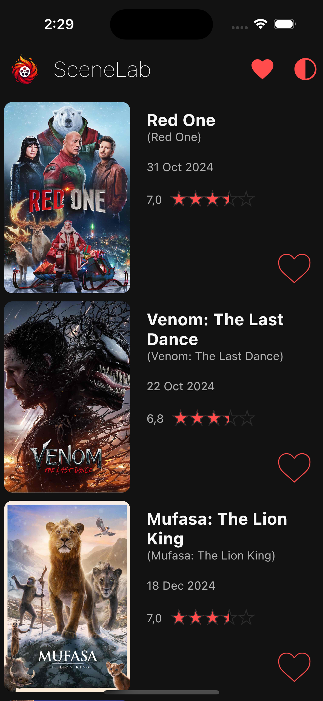  | 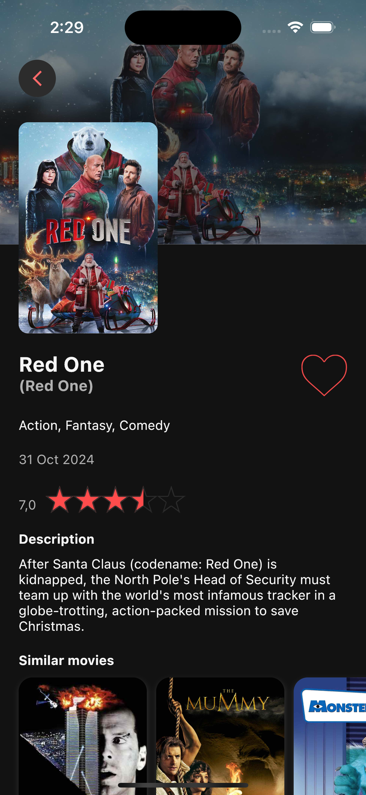  | 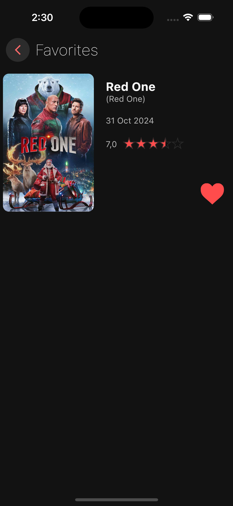  | 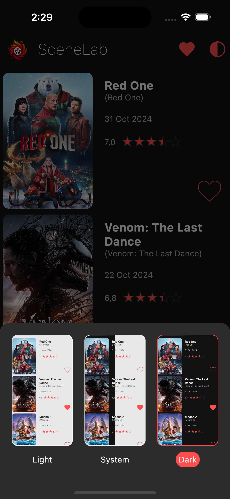  |
| **Light** | 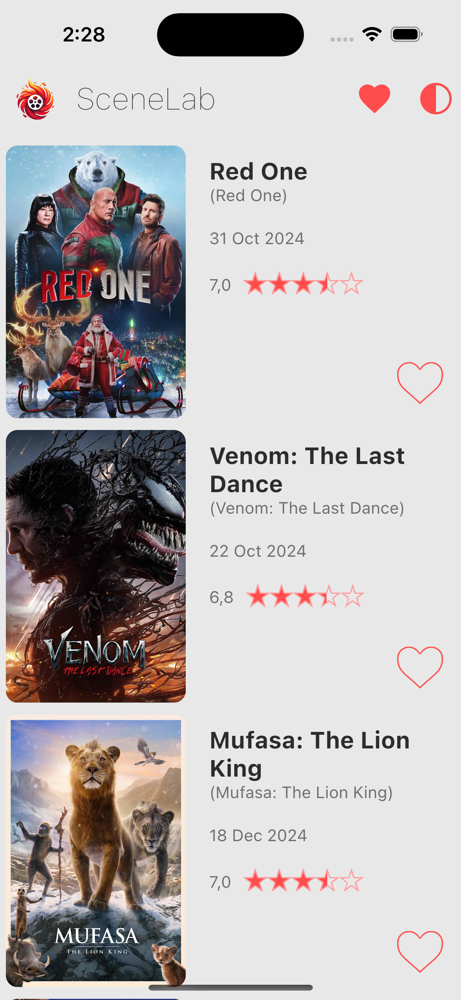 | 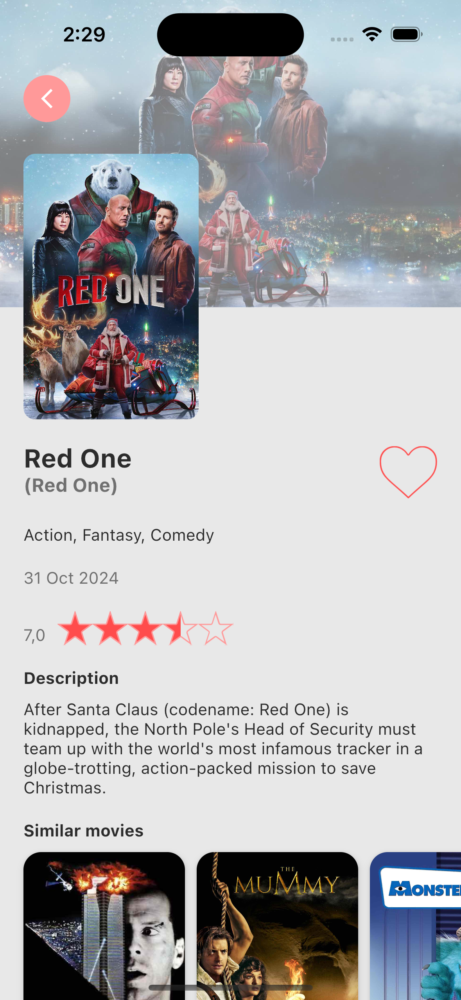 | 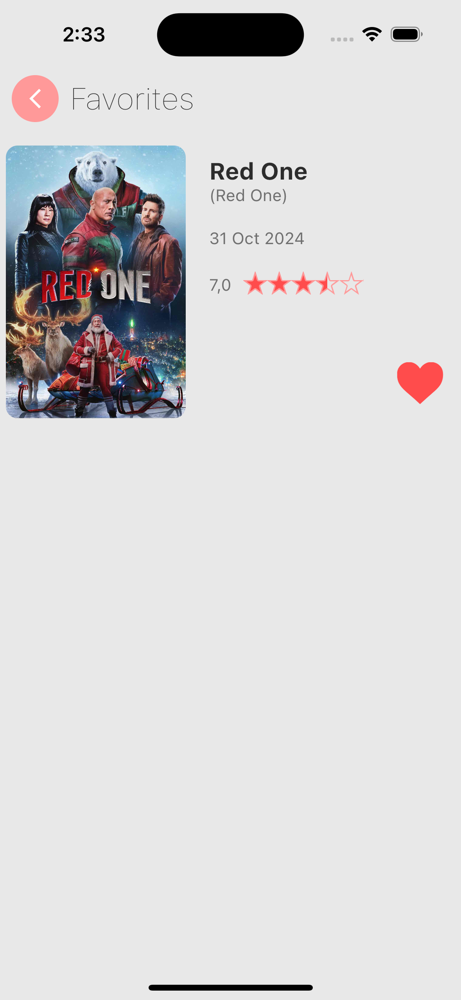 | 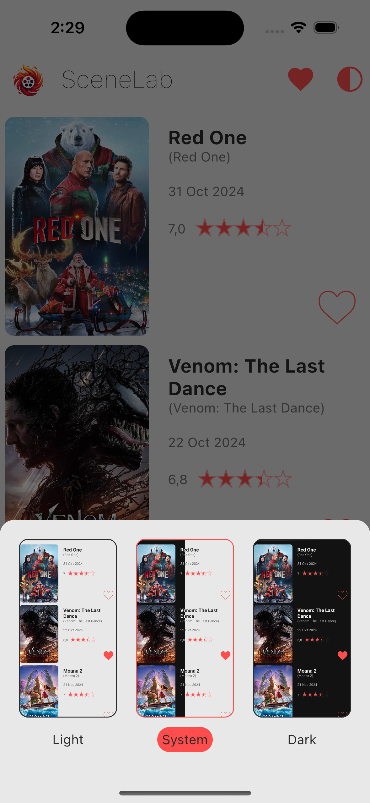 |

### **Android**

|           | **List**                                              | **Details**                                            | **Favorites**                                         | **Theme**                                              |
|-----------|-------------------------------------------------------|--------------------------------------------------------|-------------------------------------------------------|--------------------------------------------------------|
| **Dark**  | 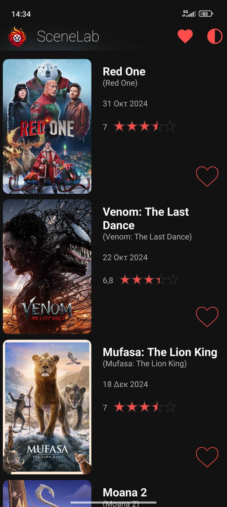  | 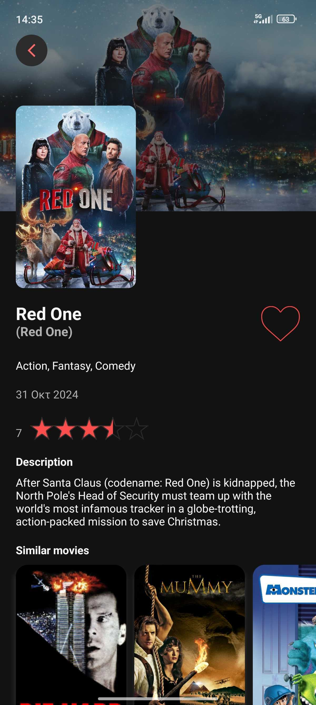  | 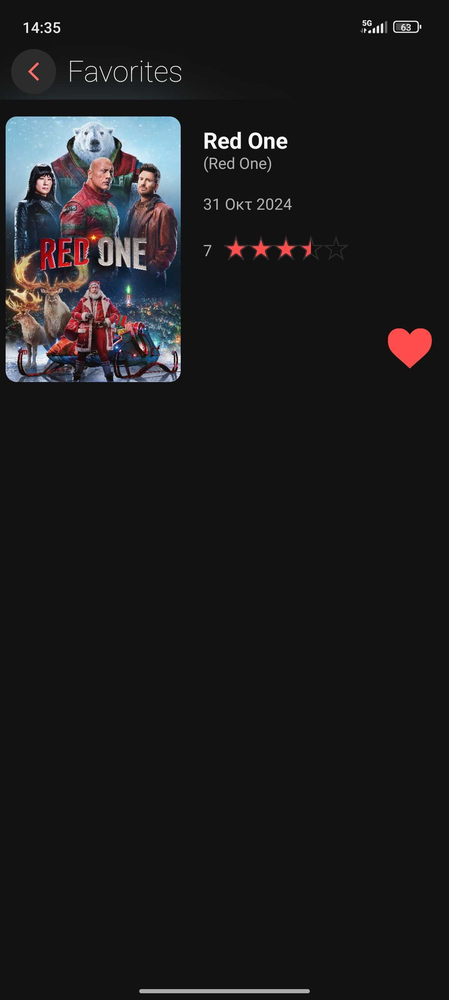  | 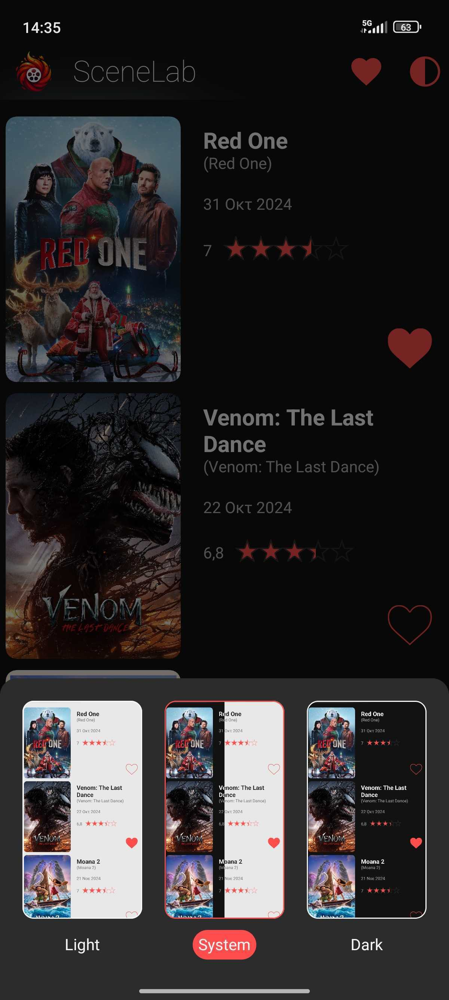  |
| **Light** | 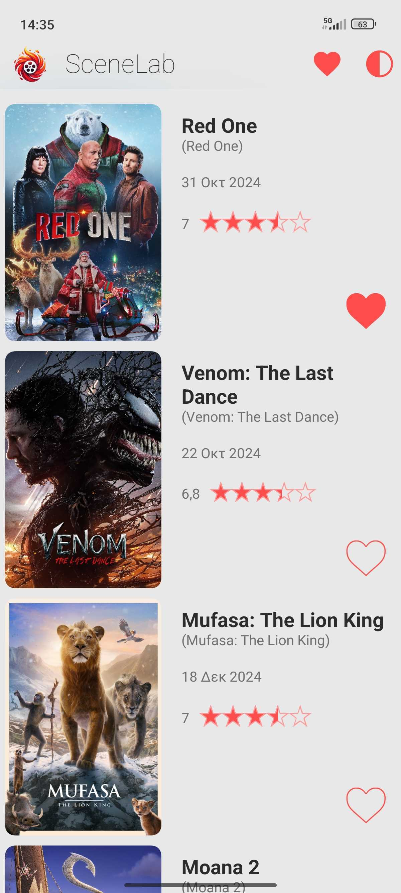 | 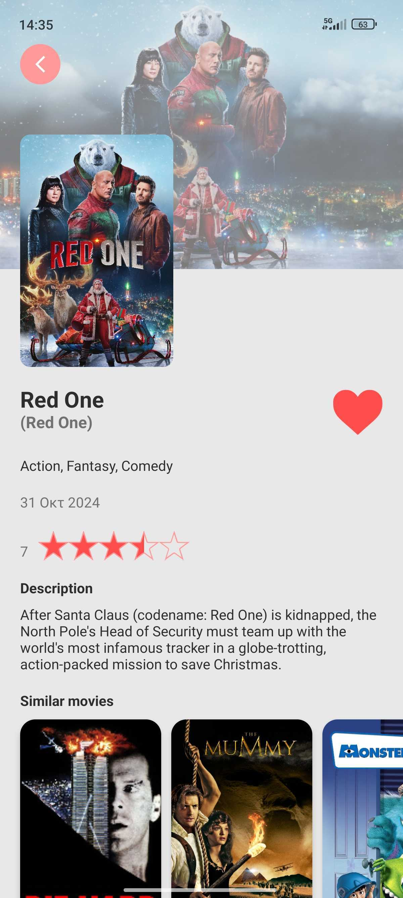 | 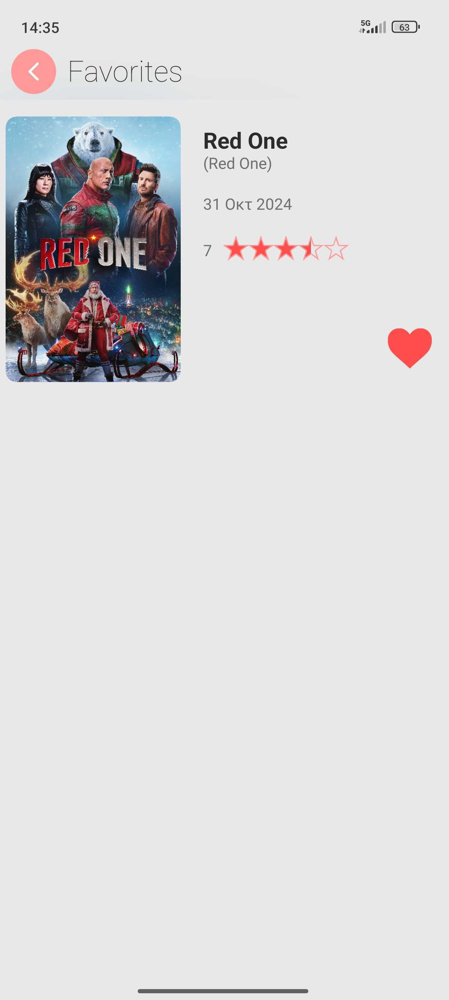 | 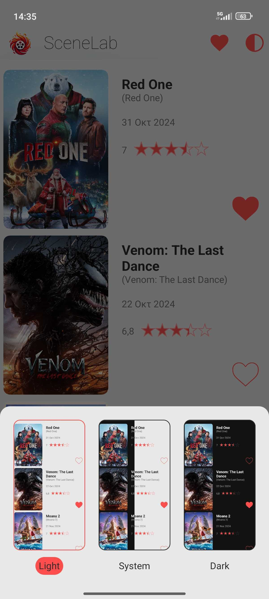 |


These assets ensure a consistent visual experience across platforms and themes, enhancing SceneLab's
modern and responsive design.

## **Contact**

We hope you enjoy using SceneLab! 😊

For inquiries or suggestions, feel free to reach out:

Symeon Papazoglou
📧 sppzglou@gmail.com
